## 一、概念 List

### 1、Web3

对比 web1、web2 会清晰些：

- Web 1.0 就是门户网站时代，用户上网就是看看图文消息，这一阶段国外代表是雅虎，国内是新浪、搜狐、网易。
- Web 2.0 则是用户可以在各种社交媒体上创造内容、实时互动，国外的平台有 YouTube、Twitter，国内则有微博、公众号、抖音等等。
- Web 1.0 和 2.0，都是所谓“中心化网络”。虽然能让普通用户创造内容成为百万博主，但平台话语权还是掌握在大公司手里，百万博主说到底也是用户。
- 而 Web3 又画了一张新饼：让用户当家作主，普通用户可以去制定平台的规则，可以规划平台的发展，甚至参与平台的分红。

所以 Web3 是：

- **又称“去中心化网络”，是互联网的下一代演进，目标是实现一个开放、安全、去中心化的互联网生态系统。**
- 基于区块链的架构，应用代码和数据分布在分布式网络中的参与节点上，而非中心化的服务器上，这也就是 Web3 最核心的“去中心化"概念。
- 底层技术：区块链、加密学、去中心化存储、P2P 网络等==分布式技术（后面会解释）==

### 2、区块链

> 相关概念：区块链、加密货币、NFT、联盟链、公有链

#### 1）区块链

一种去中心化的、可靠的、不可篡改的分布式账本技术，原理是以 `链式 + 区块` 的结构存储数据。通俗的说，就是一种更安全且去中心化的记账技术。

#### 2）加密货币与 NFT

- **加密货币**：同质化代币，每一枚币都一样的，可替代的。（目前海外流通的比特币、以太币等等都属于这类货币）
  - 就是前面狗仔的这个行为俗称挖矿，就是通过显卡提供算力做区块链运算获得报酬——加密货币。
- **NFT**
  ：非同质化代币，与加密货币不同，NFT 具有独特性，每个都不可替代的，也不可分割。就如同世上没有两片相同的树叶，世界上也没有完全相同的两个 NFT。（在国内也被称为"数字藏品"）
  - 稀缺性：这世上很多东西的价值或溢价，往往并非来自它本身，而是源于它的稀缺性。比如限量发售的球鞋、游戏王的青眼白龙卡、盲盒的隐藏款等等。那么，如果一张数字图片是独一无二的，它的价值是不是也会飞升呢？这就是 NFT 的基础概念。
  - 独特性：因为 NFT 的智能合约中都嵌入一种可进行身份识别信息，也就是说每个 NFT 都拥有独一无二的“编号”。也因此，NFT 成为纪录和存储包括艺术品、游戏和收藏品等数字产品所有权的理想选择。它可以让一张数字图片变得独一无二，所有人共同见证它是在何时何地被何人创作，又被何人买下。
  - 不可篡改且可溯源：Web3 或者说区块链，可以让数据无法篡改且可溯源，确保每一件收藏品的真伪，而不是像现在很多球鞋交易平台那样，分不清到底是不是莆田高仿。这对知识产权保护至关重要，也让更多艺术家愿意去创作数字形式的艺术品。
- NFR：国内
- **加密货币与 NFT 的关系**：你可以看做，`NFT = 商品`，`加密货币 = 可以购买商品的钱`

#### 3）ERC 标准

ERC 是 Ethereum Request for Comments 的缩写，即“以太坊征求意见”。

- 是以太坊区块链上铸造代币或 NFT 的标准协议。
- 网上常见的 ERC-20、ERC-777、ERC-721、 和
  ERC-1155 等都是，一路迭代改进而来的，目的是让[通证](https://baike.baidu.com/item/%E9%80%9A%E8%AF%81/24281877?fr=aladdin)
  能适用更多场景，和不断变化的实际需求。
  - 通证是以数字形式存在的权益凭证，它代表的是一种权利，一种固有和内在的价值。通证可以代表一切可以数字化的权益证明。
- [详细讲解可看：什么是 ERC-20、ERC-777、ERC-721 和 ERC-1155？它们有何不同？](https://www.panewslab.com/zh/articledetails/4p0e0nspprdd.html)

#### 4）联盟链与公有链

根据区块链网络中心化程度的不同，分化出 3 种不同应用场景下的链：

- **公有链**：就是任何人都可读取、发送交易且能获得有效确认的共识区块链。它完全去中心化，链上数据公开透明且不可更改，任何人都可以通过交易或挖矿读取和写入数据。以太坊就是典型的公链；
- **联盟链**：指有若干组织或机构共同参与管理的区块链，每个组织或机构控制一个或多个节点，共同记录交易数据。要想在联盟链节点上进行数据读写或者发送交易，也只有联盟内的组织机构能够做到。我们不妨简单理解为，这是一个私域池。国内做联盟链的较多，包括 bat 三大厂都有自己的至信链、蚂蚁链、百度超级链；
  - 多家企业联合在一起，共同存储托管一些不太敏感的数据，还是可行的。
- **私有链**：与公有链完全相反，是由某个组织或者机构全权控制、数据读取权限受组织规定的区块链。

#### 5）以太坊（以太币）

**以太坊**（英文 Ethereum）是一个[开源](https://baike.baidu.com/item/%E5%BC%80%E6%BA%90/246339)的有[智能合约](https://baike.baidu.com/item/%E6%99%BA%E8%83%BD%E5%90%88%E7%BA%A6/19770937)功能的公共[区块链](https://baike.baidu.com/item/%E5%8C%BA%E5%9D%97%E9%93%BE/13465666)平台，通过其专用[加密货币](https://baike.baidu.com/item/%E5%8A%A0%E5%AF%86%E8%B4%A7%E5%B8%81)[以太币](https://baike.baidu.com/item/%E4%BB%A5%E5%A4%AA%E5%B8%81/20857686)（Ether，简称“ETH”）提供[去中心化](https://baike.baidu.com/item/%E5%8E%BB%E4%B8%AD%E5%BF%83%E5%8C%96/8719532)的以太[虚拟机](https://baike.baidu.com/item/%E8%99%9A%E6%8B%9F%E6%9C%BA/104440)（Ethereum Virtual Machine）来处理点对点合约。

比特币同以太币，是区块链平台中的加密货币。

### 3、DeFi

> 相关概念：DeFi、智能合约、稳定币、算法稳定币、USDT、WBTC、gas 费等

#### 1）DeFi

DeFi，即“去中心化金融”，也称为“开放式金融”。就是提供与传统中心化金融服务类似的金融服务，如借贷、交易、保险等。且交易去中心化，记录加密。

- 通过运用加密货币和智能合约在区块链上提供交易、借贷和投资等金融服务；
  - 即是去除银行这个中心化角色，账户间的交易完全由事先写好交易逻辑的智能合约程序来执行处理。
- 交易双方可以直接达成交易，所有合同和交易细节都加密记录在区块链上；

#### 2）稳定币

是一种法币价格相关稳定的数字货币，在价格剧烈波动的数字货币市场中发挥资金避险、交易中介、支付结算等功能

- 通过一些模型设计保证价格在其所对标的法币价格上下小幅波动，目前市面大部分稳定币的价格正常情况下等于 1 美元。
  - USDT，[Tether](https://tether.to/) 公司发行，声称每一个 USDT 背后都有足额美元等价物做抵押物。（不过市场有很多人怀疑这一点）Tether 只支持用美元买入 USDT，不支持用 USDT 换回美元。
  - USDC、BUSD、HUSD 分别由交易所 Coinbase、币安、火币发行，与 USDT 不同，这几个 U 背后有余额美元做抵押，且有公开审计，且支持双向兑换赎回，因此在极端情况出现时会比 USDT 更加安全。
  - 法币：加密货币的法币交易，简单的理解是直接用法币。例如比特币报价 6 万元一个，那么不管我刷卡也好，支付宝、微信也罢，总之直接用钱来买，就是法币交易。（注解：即支持通过支付宝或微信）
- 算法稳定币，无抵押或者非足额抵押的稳定币，项目方通过各种巧妙算法机制调节供需关系，尝试让币价达到并保持一美元
  - 所以算法稳定币能凭空变出钱，但实际并不创造新的价值
  - **注意：算法稳定币本质上不是稳定币，一旦崩盘，损失可能比炒币多。**
- 分身币 / WBTC，全称 Wrapped Bitcoin，字面意思为“有包装的比特币”。它由 BitGo、Kyber Network 等区块链项目联合推出，于 2019 年 1 月正式上线。该代币在以太坊上发行，实现与比特币 `1:1` 锚定，是 [ERC-20](https://docs.openzeppelin.com/contracts/4.x/erc20) 版本的比特币，也可以理解为 BTC 在以太坊上的分身
  - 因为 BTC 公链性能太低下了，不能满足 DeFi 等应用需求，因此要影射一个分身到以太坊公链上运作。
  - 像 WBTC 那样的代币比特币还有几个，比如 imbtc、renBTC 等等

#### 3）智能合约

自动执行交易合约条款的应用程序，且条款公开透明、不可篡改。

- 可节省管理开销，程序自动运行，不像传统金融需要人工审核运营
- 可编程的，可通过 Solidity 编写合约逻辑
- 可验证的，公开透明合约的代码
- 不可篡改，一旦上链就无法更改或删除
  - 但合约一旦存在漏洞，也可能被黑客利用牟利
- 去中心化，通过分布式实现去中心化的自治

#### 4）预言机

- 有权威的第三方，推送合约需要的数据到区块链，智能合约执行时访问区块链数据使用。
  - 具有权威准确、不可篡改、服务稳定、可审计等特点
  - 例如赌球，由预言机作为结果的公证。但存在漏洞，还是赌球，预言机是取 CCTV 官网数据，若网站被攻击擅改结果数据，则失去公证，所以有人提出“预言机网络”模型。
- 预言机网络
  - 由多台预言机组合成，共同作为公证，但多台预言机的判断均一致时，才执行合约。

#### 5）gas 费

gas 费是用于测量在以太坊区块链上执行特定操作所需的成本。由两部分组成，gas limit 和 gas price

- gas limit：取决于你的合约什么类型、计算的复杂程度；
- gas price：取决于你想等多久，你要付每单位 gas 多少的价格（因为得有矿工愿意帮你验证交易，越高就会有越多、越快帮你验证的诱因）

#### 6）GameFi

所谓 GameFi 就是 Game + DeFi，即游戏与金融相融合的一种模式，简单来说，GameFi 将去中心化的金融产品通过游戏的方式呈现，把 DeFi 的规则游戏化，用户资产不仅可以作为游戏中的装备或工具，反过来用户还可以在参与游戏的过程中，获得收益及奖励。与传统游戏相比，GameFi 的特点在于：

- 游戏的去中心化程度高，没有一个公司统一运营，任何人都可以主动参与游戏的开发与建设，哪怕是游戏最初的开放者，也没有权限掌握游戏的发展、关闭游戏。
- 玩家的自由度极高，玩家们可以通过游戏治理代币进行投票，参与游戏规则的制定与完善。
- 边玩边赚，因为游戏加入了 DeFi 属性，玩家们在升级打怪兽的过程中，不仅可以获得游戏乐趣，还可以获取代币、装备、NFT 道具等，这些都能作为资产在区块链的 NFT 平台与交易平台中进行出售。

#### 7）SocialFi

SocialFi 是社交化金融的简称，它指的是社交网络和金融在区块链上的有机结合。SocialFi 的特点是去中心化、开放性和用户控制。

- 在这种新的社交平台上，每个人都可以通过和他人互动、创作内容、点赞分享等方式获取加密货币
- 这一类的平台有比如: Audius (web3 世界的 Spotify)，LBRY (web3 世界的油管)，Steemit (web3 世界的 reddita) 等等

#### 8）meme 币发行平台

##### **（1）meme**

是一种情绪，大家对某种币情绪高涨，看涨某种币，则这种币称为 meme 币。由于推出 Meme
的成本极低，因此每天都有大量新的交易对在去中心化交易所上市，这使得它成为一个快节奏的领域。但也正因如此，大多数 Meme 项目的平均寿命往往在 24 小时甚至更短，这主要是因为不良行为者试图利用这种狂热，通过精心策划骗局和营销来欺骗雄心勃勃、毫无戒心的投资者。

##### **（2）pump.fun**

Solana 生态上流量最大的 Memecoin 平台，从代币名称、logo 到流动性和流动性销毁做到了一条龙服务。（Memecoin 重点围绕社区共识和群体交易情绪进行设计，一般代币总量较大且全流通，可以配合不同宣发策略；初始价格不会设置太高，前期的价格曲线均较为陡峭，价格剧烈波动吸引资金进入。）

###### ① 发币操作

1. 部署前可以在钱包里面存 0.05 个 SOL，进入项目网站后点击右上角连接钱包。
   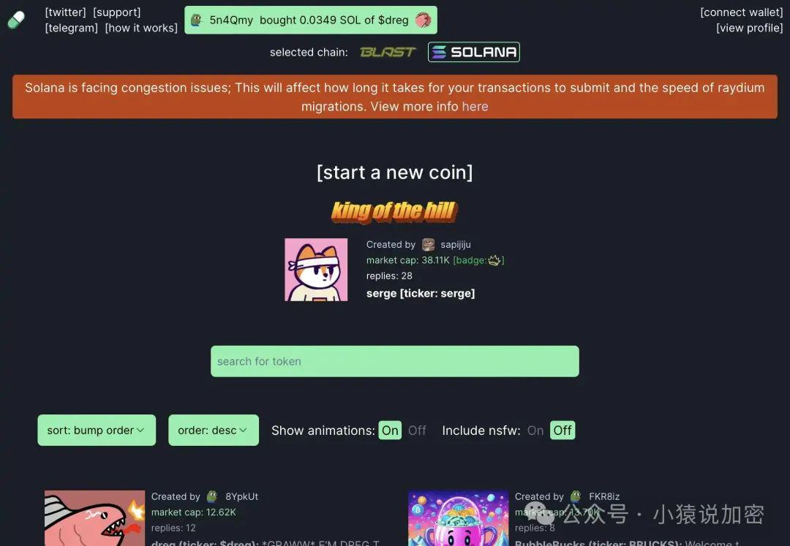
2. 连接上钱包后点击首页中央的「start a new coin」，转到部署界面输入信息，依次编写 name（创建者名称）、ticker（Meme
   币名称）、description（该 Meme 币叙事），并选择一张图片，最后点击「Create coin」创建一枚 Meme。
   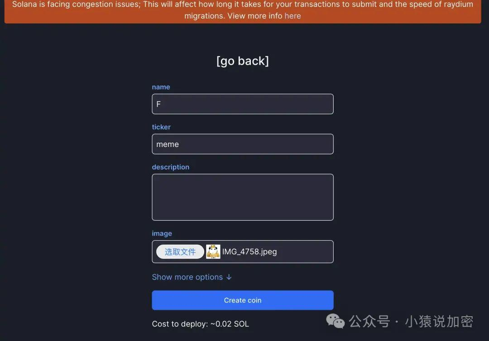
3. 之后会显示是否要提前购买自己部署的 Meme，提前购买可以防止机器人狙击代币，购买可选可不选，没有强制要求。部署成本为 0.02 SOL
   是一定要支付的费用，支付完费用就完成了部署。
   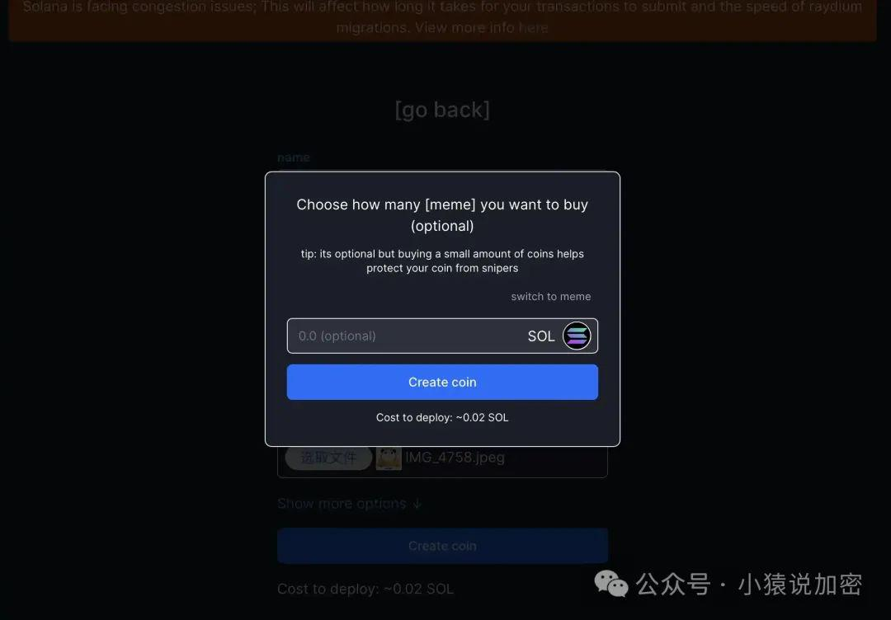
4. 向 Raydium 存入 12,000 美元的流动性并销毁

   达到市值目标后，平台会在 Raydium（一个流行的去中心化交易所）存入 12,000 美元的流动性，并销毁相应的代币。这一步骤有助于增加币种的流动性和稳定性，同时通过销毁代币减少供应，可能推高价格。（PUMP.FUN 上所有 Memecoin 共享相同经济模型，代币总量恒定，用户在 Bonding Curve 上以合理价格 Mint 部分代币，剩下代币与募集资金组成 LP 池。）

5. 案例：PUMP.FUN 产品细节清晰，用户可以花费 0.02 $SOL，一键发布 Memecoin，这个 Memecoin 初始虚拟市值为 30 $SOL，其他用户募资 85 $SOL 获得 8 亿枚代币，PUMP.FUN 再铸造 2 亿枚代币，结合形成交易对被添加至 Raydium，最终上线可以得到一个市值为 410 $SOL，代币总量为 10 亿的去中心化发行的 Memecoin。
6. 现平台还加入**直播功能**，将新兴 Memecoin 的发行和运营以直播和视频的形式展示，为流量和资金的破圈提供了适合的方式。

###### ② 买币操作

1. 先发现 Meme 币，选择你喜欢的币种。
   在 Pump 平台上，你可以浏览各种币种。每种币都是公平发行的，没有预售和团队持有份额，这意味着每个人都是在同一起跑线上。
2. 然后检查其在 Birdeye 或 DEXscreener 上的所有细节。
3. 在债券曲线上购买币种
   所谓的“债券曲线”是一个定价机制，它根据代币的供求关系自动调整价格。你可以在这个曲线上购买你选择的币种。（初始价格不会设置太高，前期的价格曲线均较为陡峭，价格剧烈波动吸引资金进入。）
4. 随时出售以锁定你的盈亏。
   购买代币后，你可以随时决定出售你的代币。出售时，你可以根据当前的市场价格锁定利润或损失。
5. 当足够多的人在债券曲线上购买时，市值达到 6.9 万美元
   随着越来越多的人购买，这个新币种的市值会增加。当市值达到 69,000 美元时，这个币种就达到了一个重要的里程碑。
6. 向 Raydium 存入 12,000 美元的流动性并销毁
   达到市值目标后，平台会在 Raydium（一个流行的去中心化交易所）存入 12,000 美元的流动性，并销毁相应的代币。这一步骤有助于增加币种的流动性和稳定性，同时通过销毁代币减少供应，可能推高价格。

###### ③ 工作原理

- **创建 Memecoin**： 用户可以通过支付少量的 $SOL（例如 0.02 $SOL）来创建一个新的 Memecoin。在创建过程中，用户需要为其
  Memecoin 定义一个名称、代号和上传一张代表性的 JPG 图片。每个新创建的 Memecoin 都有一个初始的虚拟市值，通常设定为 30
  $SOL，以此吸引初始投资者的兴趣。
- **标准化经济模型**：Pump.fun 使用一种标准化的经济模型，为其平台上所有 Memecoin 提供一个固定的框架。这种模型的特点和运作机制如下：
- **代币总量恒定**：每个 Memecoin 的总发行量被固定，确保供应的一致性和可预测性。通常这个总量是预先设定的，比如 10 亿枚代币。
- **Bonding Curve（联合曲线）**： 用户在创建 Memecoin
  时，可以通过联合曲线以合理的价格铸造（Mint）代币。联合曲线是一种算法，用于根据当前供应量动态调整代币价格，旨在平衡供需关系，使得早期参与者通常能以较低价格购买代币。
- **募资和流动性池（LP 池）**：用户通过购买新铸造的代币来募集资金。这部分募集来的资金和未售出的代币一起被用来创建流动性池（LP 池）。这些资金和代币形成交易对，被添加到去中心化交易平台（如 Raydium）上。这种做法增加了市场流动性，使得代币能够在去中心化交易所如 Raydium 上进行交易。
- **流动性管理**：当 Memecoin 的市值增长并达到特定的目标（如 69,000 美元）时，会有一部分资金（如 12,000 美元）的流动性被永久锁定并可能销毁，这有助于维持市场稳定性并保护投资者的利益，增加信任度。
- **费用和收益**： Pump.fun 在整个流程中收取一定的费用，包括交易费（1%）和上币费（6 $SOL），作为平台的运营和维护成本。

###### ④ 发币模式

- 直接部署代币并在 Raydium 等 DEX 上建立流动性，然后放弃铸币权，锁定或销毁流动性提供者代币。
- 进行预售，参与者将资金发送到一个地址，而不会立即返回。

###### ⑤ 平台角色

**Memecoin creator**

- 可以是加密艺术家、 Memecoin 叙事的早期布道者、某个利用平台进行宣发的项目方，现在破圈以后甚至可以是各界名人。
- 名人在 PUMP.FUN 发行代币，跨圈互动和加密用户一起参与 Memecoin 热潮，名人代币和 NFT 资产可以作为名人 IP 的其中一项产品。早期发现者利用认知和影响力，为特定的 Memecoin 站台形成新的 Meme coin 叙事，叙事下建立的社区有机会进一步破圈。去中心化发行平台 PUMP.FUN 在帮助你省去中间环节的过程中，能够在极短时间内为你的代币带来足够的资金和流量支持。

**Memecoin trader**

- Memecoin Trader 作为近期在链上最活跃的玩家，在追踪钱包、利用工具、关注社交媒体的同时，需要构建自己的交易策略，才能在高风险高收益的游戏中盈利。相比于其他风险资产而已，交易员在
  Memecoin 上的盈利更不稳定，胜率普遍不高，且因为平台特性导致交易节奏变得越来越快，变向增加亏损的概率。

**Memecoin opportunist**

1. 狙击策略：
   PUMP.FUN 每上线一个新的 Memecoin，snipe bot 在经过指标的筛选后，会在几秒钟内完成前几笔买入交易。因为进场位置足够低，前期定价曲线比较陡峭，Memecoin 整体市场热度持续，这个策略在过去几个月能够抓住几个涨幅巨大的标的。
2. 反狙击策略：

###### ⑥ 优势

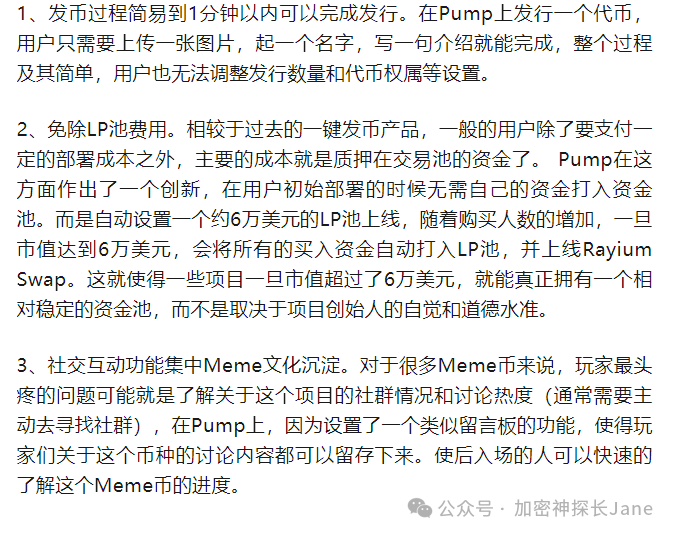

- 低于 2 美元的成本价、短时间部署代币。（传统的发币流程，需要考虑到昂贵的设置费用和对大量流动性播种的需求，这个过程可能导致高昂的成本。）
- 平台发币功能到后续上交易所的功能比较齐全。
- 创建者在部署代币时就自动放弃了铸币权，这也意味着 Pump.fun 的代币将没有名义上的项目方和管理者，因此不会出现因超级权限而引发的 RUG 问题。（传统的发币具有复杂性和风险，毕竟预售容易受到骗局的影响，需要先进的工具来监控诸如放弃代币铸造权等行为）
- Pump.Fun 还通过消除创建者对发币流程的干预来提高平台的公平性。平台上的流动性是人为创建的，并且在平台保留的联合曲线上运行。一旦 Pump.Fun 代币在 Raydium 上线，流动性就会自动燃烧，从而锁定 AMM 流动性。这意味着即使作为项目创建者，也无法阻止这一过程的进行。
- 创新点：它将社交网络活动与金融激励直接相连。不同于传统社交媒体主要通过广告收入获利，Pump.Fun 让用户通过参与和投资特定的社交媒体帖子（即代币）直接获利。这种模式可能会极大地改变人们发布和互动的方式，因为金融回报成为了一个重要因素。

###### ⑦ 风险

- pvp 现象严重，参与 presale 的少数人拿到了大部分筹码，在开放交易后一般都会出现 50%-90%
  的回撤。虽然代币开盘涨幅太大会导致没有新用户敢购买代币，但也有不少用户在在开盘的极早期买入从而获得不小的利润。
- Raydium 崩盘风险当代币到达 Raydium 交易所时，存在极高的风险，代币价格可能会迅速下跌（俗称“dump”），如果用户没有在正确的时间点退出，可能会遭受损失。这种价格暴跌通常是由于早期投资者和开发者在代币上市时迅速抛售所致。
- 欺诈高发区由于 Pump.Fun 入门门槛低，该平台成为了欺诈活动的温床。估计有高达 95%的项目可能纯粹是为了诈骗投资者而设立。这些欺诈行为可能包括：

  - 开发者抛售（Dev Dump）：项目创建者（开发者）可能在代币迁移到 Raydium 之前出售自己的持仓，导致价格暴跌。这种行为很难被发现，因为它看起来像是正常的交易活动。
  - 价格操纵（Pump.fun Bundle）：开发者使用多个钱包人为抬高价格，然后在达到 Raydium 之前抛售所有代币。需要警惕的是，持有大量新钱包的顶级持有者异常增多。
  - 大买家和抛售（Big Buyer and Dump）：开发者制造大买家的假象以吸引新投资者，然后在不久之后抛售代币。对于单一持有者控制超过 10%供应量的代币要特别小心。

- 需要注意的警示
  - 钱包突然涌入：大量新钱包只购买特定代币是一个重大的红旗警示。
  - 检查开发者过往项目：开发者如果有抛售项目的历史，这是一个不好的信号。
  - 少数钱包持有大量供应：如果只有少数几个钱包持有代币的大部分供应量，需警惕。
  - 重复使用的项目名称、网站或 Twitter 账户：这些都可能是欺诈的迹象。
  - 链接不功能：链接失效通常是项目不靠谱的明确迹象。
  - 开发者不更新 DEX 筛选网站信息：如果开发者不愿意支付费用更新去中心化交易所筛选网站上的信息，通常不是好兆头。

###### ⑧ 市场分析（Dune 数据分析）

1. 平台收入：

- 三月中旬迎来第一波增长，作为赛道不是最早占据生态位的玩家，用户在这段时间逐渐被接受，平台筛选出的几个 Memecoin 也创造了不少的造富故事，3 月 26 日上线的 $SC 几天便来到上亿市值。其他用户创建的 Memecoin 由于处于初期，也均有不同程度的造富效应。平台每日收入达到 1000 $SOL，且后续不断增长。
- 月到五月初迎来爆发期，4 月 8 日上线的 $michi 突破 2 亿市值点燃了市场的情绪。Memecoin 叙事切换迅速，仿盘层出不穷，从夏季奥运会带来的国家币到宗教币，再到特朗普概念币，每天大概都有成千上万的 Memecoin 被创建交易。平台每日收入平均突破 2000 $SOL。
- 五月中旬到五月末，5 月 13 日 GME 股票大涨的同时，用户在 PUMP.FUN 创建的相关 Memecoin 也为平台创造了收入的纪录，达到 120 万美金。后在经历了前员工的攻击后（由于 PUMP.FUN 平台创建交易对的钱包账户权限被前员工盗取，造成大量 Memecoin 完成募资后不能上线 Raydium，用户损失金额达 200 万美金，PUMP.FUN 为挽回用户采取平台收益减免措施。），PUMP.FUN 在热度的短暂下降又迎来了进一步的破圈，名人创建的 Memecoin 带来的热度将平台收入重新提升至 100 万美金，破圈后的平均每日收入达 70 万美金，平台总收入来到将近 3700 万美元。

2. 用户增长

- PUMP.FUN 用户数量至今属于上升期，偶有波折但用户为平台带来热度不曾减弱。4 月 16 日前，平台新用户每日剧增，一个月内聚集近三万五千名活跃用户，平台产品培养的用户习惯逐渐为后续留存打下基础。
- 四月下旬到五月，平台每日新增用户数量放缓，后经过名人效应破圈，平台活跃用户数在 5 月 30 日达到顶峰为 64378，后续每日新增用户数。

3. 产品（memecoin）增长

- 在 PUMP.FUN 上创建的 Memecoin 数量随活跃用户数量变化，从平台上线以来共创建 862988 个 Memecoin，五月以来平均每天新增 15000 个新 Memecoin。
- 其中仅 10707 个能够被发射到 Raydium 供更大范围交易，综合表明平台收入大部分依靠交易手续费，创建代币和上币费所占较小。

###### ⑨ 竞品分析


- 不同于其他竞品带给用户平和静态的感受，点开 PUMP.FUN 网站，最直观的感受是跳动的数字和动态的画面，高饱和度设计刺激用户感官，情绪被调动如同面对 Memecoin 交易般狂热、魔幻；介绍玩法也只有简单五句话，符合 Memecoin 交易用户短平快的特点，但其他页面介绍代币相关信息十分详细，方便新的购买者形成社区共识。平台的 Logo 是一颗绿色小药丸，似乎是想表达治愈的药丸却让人上瘾，平台的用户已经无法自拔。
- 不同于 PUMP.FUN 背靠 Solana 生态，meme.market / werich\_ / rugdotfun / Momentum_v1 均选择在 Base 链上开发，而 Base 链上资金和注意力被 FRIEND.TECH 和 Farcaster 转移，Memecoin 借助 Socialfi 平台，已经解决了冷启动的问题，且 $DEGEN 和 $Friend 代币市值很大，能够给予两个平台其他 Memecoin 想象空间。Base 链的 Memecoin Launchpad 赛道，用户已经习惯了 FRIEND.TECH 和 Farcaster 通过社交模式构建的回音壁，资金和流量已被瓜分殆尽。
- DEGEN.FUND 上线 Solana，类似的 Bonding Curve 和试图用更便宜的平台费用并未持续吸引市场，形成足够的规模，作为龙头标的炒作的 $IYKYK 代币也经过链上玩家短期炒作后归于平淡。


### 4、DAO

[DAO 是什么？](https://tgn5x5g84p.feishu.cn/wiki/LlgZwAokViKPS9kpN75crcfJnuf)

DAO 是去中心化自治组织的简称，它是一种基于区块链的组织或公司形式，通常由一个本地的加密代币来管理和治理。

- DAO 的成员拥有 DAO 的代币，并可以通过投票来决定组织的方向和行动。
- DAO 没有中央权威或领导者，而是由区块链上的规则和智能合约来执行协议和分配资源。
- DAO 可以让志同道合的人在全球范围内共同追求一个共同的使命。
  有很多不同类型的 DAO 项目，根据市值排名，一些比较知名的 DAO 项目有：
- Uniswap (UNI)：去中心化的交易所，允许用户在以太坊上交易任何 ERC-20 代币。
- Aave (AAVE)：去中心化的借贷平台，提供闪电贷、利率切换、抵押品委托等服务。
- Maker (MKR)：去中心化的稳定币系统，通过智能合约和抵押品来维持 DAI 代币的价格稳定。
- Compound (COMP)：去中心化的货币市场协议，让用户可以借入或借出加密资产并赚取利息
- Decentraland (MANA)：基于以太坊的虚拟世界，让用户可以创建、探索和交易数字土地和资产

### 5、元宇宙

元宇宙是一种由多个数字空间组成的虚拟世界，用户可以在其中进行社交、学习、娱乐等活动。它是互联网的下一代演进，比互联网更具沉浸感和交互性。元宇宙是由物理现实和数字现实的融合而产生的，用户可以通过不同的设备（如手机、电脑、VR 眼镜等）来访问和体验元宇宙。

### 6、加密钱包

加密货币钱包，也就是数字钱包，是虚拟储存你持有的电子货币的容器。从根本上说，是一个软件程序。（及存储管理加密货币的工具）

#### 钱包的分类

##### 1）在线钱包

通过云服务运行，可以通过浏览器访问它们。在线钱包的代表有 GreenAddress 和许多提供钱包服务以及交易平台的交易所。在线钱包是最流行的钱包类型之一，方便实用，并具有多种功能。

- 使用方便：大部分加密货币交易所都集成了钱包功能
- 安全性最差：由于钱包在线运行，与其他类型的钱包相比，它们更容易被黑客入侵
  - 你的公钥和私钥存储在服务器上，如果服务器被攻克，那么你的密钥就可能会被盗窃
  - 如果服务器崩溃或者关闭，你就无法访问你的钱包。
- 可能被限制交易上限：一些在线钱包还会限制你每天的最高交易上限。

##### 2）桌面钱包

就在你的电脑上运行的软件。你只需下载桌面钱包软件，然后安装即可。他们可以像运行其他任何桌面应用程序一样运行这些钱包。时下流行的桌面钱包包括 electrum，exodus 和 copay 等等。

- 使用较方便：这些钱包拥有用户友好的界面，可实现多种功能，并从你安装这些软件的设备访问。
- 存在一定风险：如果你的系统因为病毒而受到攻击，你的钱包信息就可能会盗取。如果系统损坏，你也可能因此无法提现而损失资金。
- 消耗大量时间和带宽：桌面钱包会将整个区块链账本下载到你的计算机上，整个账本体积很大（大约需要 50GB 的空间）。

##### 3）移动钱包

移动钱包其实只是你手机上的一个应用程序。它们拥有无与伦比的便利性，因为你可以使用移动钱包在商店购买商品，完成支付。移动钱包的例子有 [Mycelium](https://link.zhihu.com/?target=https%3A//play.google.com/store/apps/details%3Fid%3Dcom.mycelium.wallet%26hl%3Den)，[Airbitz](https://link.zhihu.com/?target=https%3A//itunes.apple.com/us/app/airbitz-bitcoin-wallet/id843536046%3Fmt%3D8) 和 [比特币钱包](https://link.zhihu.com/?target=https%3A//play.google.com/store/apps/details%3Fid%3Dde.schildbach.wallet%26hl%3Den)。

- 安全性较差：只比在线钱包好一丢丢。因为手机非常容易受到黑客攻击，如果你的手机遭到黑客入侵或者干脆你把手机弄丢了，那么你手机上的资金也就和手机一起随风而逝了。

##### 4）硬件钱包

它们不存储在云端或任何特定设备上，并且与互联网隔绝。大多数情况下，它们以 USB 设备的形式存在，当你要使用硬件钱包时，可以将其插入到设备中。硬件钱包的例子有 [ledger-nano-s](https://link.zhihu.com/?target=https%3A//www.ledgerwallet.com/products/ledger-nano-s) 和 [Trezor](https://link.zhihu.com/?target=https%3A//trezor.io/) 。

- 非常安全：因为他们几乎从未连接到互联网。插入并使用它时，你可以进行安全的在线交易。
- 昂贵且有一定学习门槛
- 存在一定风险：如果你丢失了作为钱包的 USB 设备，你就失去了你的钱包和所有的资金。

##### 5）纸质钱包

有了这些钱包，可以将生成的公钥和私钥打印在一张纸上 - 它们是你秘钥的"硬拷贝"版本。还可以在纸上记下生成这些安全密钥的软件。

- 最安全的：在所有钱包中，纸质钱包是最安全的，同硬件钱包，它们都处于离线状态。
- 存在一定风险：丢失一张纸是再容易不过的事情。丢失你的秘钥就如同丢失了你的银行帐号和密码，当然你也可以打印多份拷贝以防止丢失，但这会使盗窃更容易发生。纸质钱包使用起来也不方便，并且需要懂得生成秘钥相关的技术知识。

#### 钱包的安全使用

按具体情况具体分析，基本规则如下：

- 使用在线，桌面和移动钱包进行小额交易。
- 在交易所上使用钱包进行交易。
- 使用硬件或纸质钱包安全地存储大量资金。
- 重点：将你的资金分配到不同类型的钱包中。

### 7、交易所

#### 1）DEX（去中心化交易所）

DEX 没有中央权威的情况下运作的平台。他们利用区块链技术，特别是智能合约，来自动化交易过程。

**① 特点**

- 非托管：在 DEX 中，用户保留对其资金的控制权，从而降低因交易所黑客攻击而造成损失的风险。
- 隐私：DEX 通常不要求用户接受了解你的客户（KYC）检查，确保用户隐私。
- 开放且无需许可：DEX 对任何地方的任何人开放，使其具有高度包容性。

**② 优点和缺点**

- 优点：用户友好的界面、高流动性、操作步骤简单，进度比较快。
- 缺点：黑客风险、安全性不高，需要靠自己备份保管钱包助记词，假如自己没有备份钱包助记词，手机或者电脑丢了，就无法找回账号。

##### （1）Uniswap（以太坊区块链）

1. 是什么：是基于恒定乘积共识的去中心化交易平台，是最早且最受欢迎的 AMM 之一。

- 恒定乘积公式：Uniswap 使用一种简单但有效的价格算法，即恒定乘积公式 ×y=k。 在这个公式中，和 y 代表流动性池中的两种代币的数量，k 是一个常数。在任何交易之后， 这个公式必须保持平衡。这意味着，某一种代币的数量增加时，另一种代币的数量必须相应减少，以保持乘积 k 不变。
- 流动性池：用户可以将等值的两种代币存入一个流动性池 （liquiditypool）中，从而成为流动性提供者（LP）；例如，用户可以存入等值的以太币（ETH）和某种 ERC-20 代币。作为回报，流动性提供者会获得流动性代币（LPtokens），这些代币代表他们在池中的份额。
- 交易过程：当用户在 Uniswap 上进行交易时，他们实际上是在与流动性池进行交易，而不是与其他用户。Uniswap 会根据流动性池中的代币比例来确定交易价格，并立即执行交易。这种机制确保了流动性池始终有足够的资产供用户交易。

2. 底层结构：
   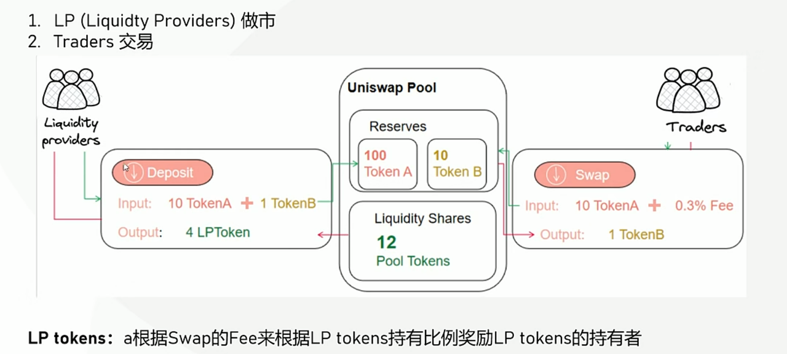
3. 定价机制

- 实际支付 3.009 个 TokenA（包含 0.3% 的 fee）：假定用户输入了 dx 数量的 token0，并希望兑取 token1，则会满足如下公式：这 0.3% 实际上从输入量（本金）上扣除的，类似于 “砍头息”。（Unisway 会将流动性池中每一笔交易产生的 0.3% 手续费，按照贡献份额全部分配给流动性提供者。在 Uniswap 上交易是有手续费的。第一，要让交易被打包进以太坊区块链就要付 gas fee，这笔钱跟交易的金额大小无关。第二，Uniswap 会对每一笔 ETH =Token 的交易抽取 0.3% 的费用，这笔费用称为 liquidity provider fee（流动性提供者费用） ，会付给流动性提供者们。
  
  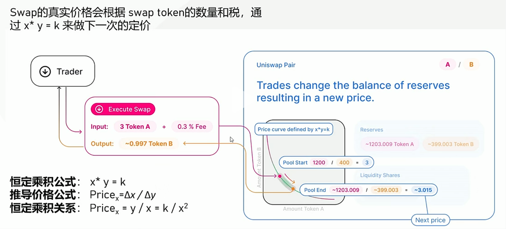

4. 滑点机制
   可以设置一个百分比，防止现价过高和过低，
5. 三明治攻击套利
   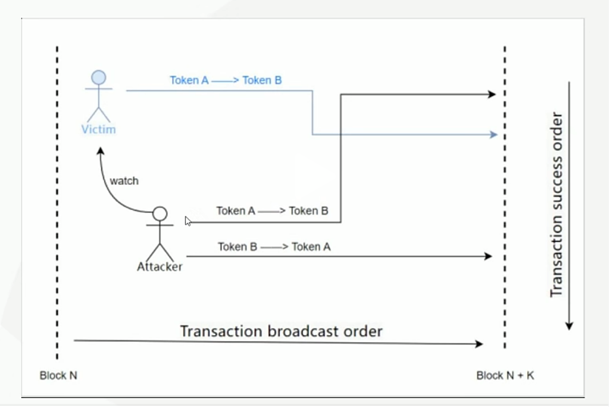
6. uniswap-V2 的相关功能介绍
   

- V1：tokenx 变成 eth，再同通过 eth 变成 tokeny，双倍的 gasfee，双倍三明治攻击的风险，价格前后也会变。
- V2：tokenx-tokeny，池子的流动恒性是分布在无穷区域上，每个币价格区间是从 0 到正无穷，早期流动性不高的，价格变化很陡，适合风险投资的人，币价可以拥有无穷的想象，恒定乘积做市商。缺点：资产利用效率的不足。
  V2 案例：
  `    Alice 和 Bob 都决定在Uniswap V3 上的 ETH/DAI 池中提供流动性。他们每个人都有 10,000 美元，而 ETH 的当前价格为 1,750 美元。 
    Alice 将她的全部资金分配给 ETH 和DAI，并将其部署在整个价格范围内（类似于 V2）。她存入5,000 DAI 和 2.85 ETH。 
    Bob 决定集中他的流动性并在 1,500 到 2,500 的价格范围内提供资金，而不是使用他的全部资金。他存入 600 DAI 和 0.37 ETH - 总计 1200 美元，并保留剩余的 8800 美元用于其他用途。 
    有趣的是，只要 ETH/DAI 价格保持在 1,500 到 2,500 的范围内，它们都可以获得相同数量的交易费用。**这意味着鲍勃只能提供爱丽丝资本的 12% 并且仍然获得相同的回报——使他的资本比爱丽丝的资本效率高 8.34 倍。**
    最重要的是，鲍勃将较少的总资本置
   `

- V3：引入了集中流动性，改进了资产无限大和无限小的问题。LP 可以选择提供流动性的价格区间，提高资产利用效率，对应池子的费率（fee-tick 一一对应）进行不同配置，当价格一边倾斜的时候。缺点，每一个交易对可以右 4 个池子，与 V2 相比，创建 pool 合约消耗更多的 gas。跨池子交易使得交易成本提高。
  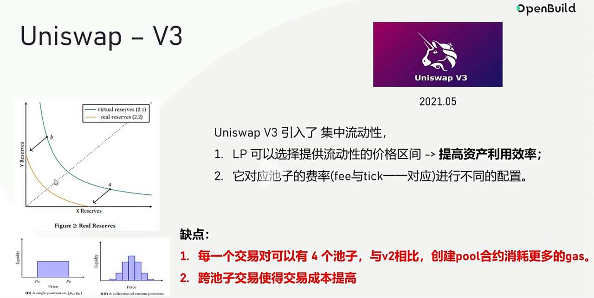
  V3 案例：
  ```
  场景一
  ETH 现货价格为 2000 美元，LP 预期 ETH 的价格将在 1900-2100 美元范围内横盘波动，于是决定在 1900 到 2100 美元范围内做市以赚取手续费。依据 V3 新的算法，LP 将需要向协议支付等值的 ETH 与 USDC 流动性，比如 5 个 ETH 与 10000 个 USDC，市值合计 2 万美元。可以看出，由于现货价格正好处于做市价格范围的中间点，在此场景下，V3 与在 V2 版本中的做市操作没有明显的区别。
      场景二
      ETH 现货价格涨到 2300 美元，LP 依然希望在 1900-2100 美元范围内做市。由于此时现货价格已经高于 LP 选择的价格区间的上限，此时 LP 将必须全部以 USDC 进行做市。当然，由于现货价格高于做市价格区间，此时 LP 也将无法获得手续费。只有等待 ETH 价格逐渐下降到 2100 美元以内，LP 的做市资金才会逐渐由 USDC 兑换为 ETH，并且开始积累手续费收入。

      场景三
      ETH 现货价格降到 1700 美元，LP 依然希望在 1900-2100 美元范围内做市。我想读者们到此已经能够看出，这时候 LP 需要全部以 ETH 向协议提供流动性。等到 ETH 价格上涨到 1900 美元后，才能开始获得手续费收入。可以看出，LP 投入做市资金的币种构成，取决于现货价格与做市价格范围的相对位置。如果现货价格处于做市价格范围以外，LP 必须全部以单一币种做市。
      ```

7. 主要场景和功能

- （场景一）：不同币种之间的兑换
  小王有 AXS 和 UNI 两种资产，这两种资产在主流中心化交易所都可以用 USDT 交易，但如果小王想把 AXS 换成 UNI，那么他需要做两笔交易——先把 AXS 卖掉换成 USDT，再用 USDT 买 UNI。而在 Uniswap 上他可以直接将 AXS 换成 UNI，大大提高了交易效率。
- （场景二）：流动性挖矿
  李四有一笔较大的 ETH 和 UNI 闲置资产，他希望可以把这笔钱借出去来提高自己的收益，那么在 Uniswap 中他可以向 ETH/UNI 资金池中注入流动性从而获得回报。
- （场景三）：看交易数据
  - Curve（以太坊区块链）
  - Pancakeswap（币安链）
  - Orca（Solana 链）

#### 2）CEX（中心化交易所）

CEX 是一个传统的交易所，用户在交易所存入资金，交易所保管资金，充当中介来促进交易。

**① 特点**

- 托管：CEX 持有用户的资金，提供一定程度的便利和熟悉度，特别是对于那些刚接触加密货币领域的人来说。
- 高流动性：由于用户数量众多，CEX 通常提供高流动性，确保交易顺利、快速。
- 用户支持：CEX 提供客户支持，帮助用户解决任何问题或疑问。
- 法定货币网关：CEX 通常充当加密货币和法定货币之间的桥梁，允许用户使用当地货币购买加密货币。

**② 优点和缺点**

- 优点：交易所会帮用户保管账户，很安全，假如遇到账号丢失可以通过身份信息找回。
- 缺点：登入需要二次身份验证，交易操作需要邮箱验和二次身份验证，步骤多一些，有点影响交易进度。

### 8、浏览器

1）以太坊浏览器（https://etherscan.io/）

- 概念：是一种用于浏览和查询区块链数据的在线工具或平台。它们提供了对区块链网络中的交易、区块、地址、合约和其他相关信息的可视化展示和查询功能。
- 支持中文语言
  
- 地址查询：用户可以通过以太坊地址查询信息，如该地址的余额、交易历史记录、代币持有量等。
- 以太坊上账户类型：外部拥有账户（EOA）和合约地址。
  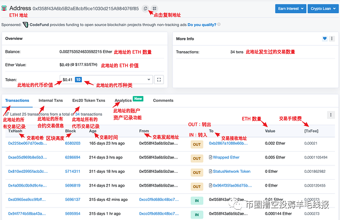
- 区块查询：可以查询以太坊网络上的区块，包括最新区块和历史区块。用户可以查看区块的哈希值、时间戳、交易数量等信息。
- 区块高度（Block Height）：以太坊网络中的每个区块都有一个唯一的区块高度，表示该区块在链中的位置。Etherscan 可以显示当前的最新区块高度，方便用户追踪以太坊网络的区块同步进度。
- 哈希值（Hash）：在区块链中，每个区块和交易都有一个唯一的哈希值，用于标识和验证数据的完整性。Etherscan 显示每个区块和交易的哈希值，用户可以通过哈希值来查找和验证特定的区块或交易。
- 交易查询（Transaction Lookup）：用户可以在 Etherscan 上通过交易哈希值查询特定的交易，获取有关该交易的详细信息，如发送方、接收方、交易金额等。
- Etherscan 中分析不同类型的交易：
  - 转账 ETH（一个人转给另一个人，不涉及合约交互）
    > 举例：这笔交易中：地址 0x835056 向 V 神转入 0.00357 ETH，交易消耗手续费：0.001065288083706 ETH。
    > 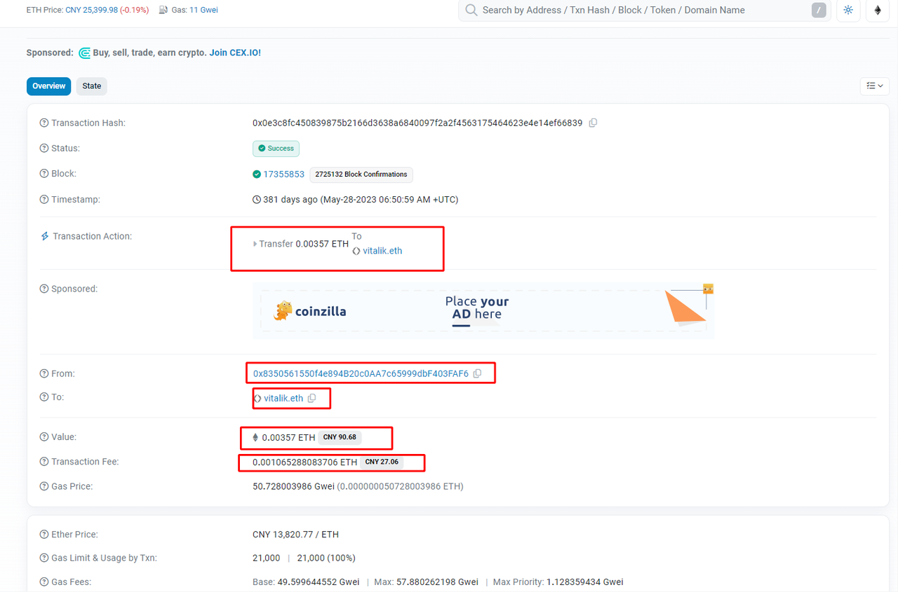
  - 转账代币 — ERC-20 类型
    > 举例：这笔交易中：地址 0x5E24BB 给 V 神转账了 1 TRU。
    > 
  - 转账 NFT-ERC-721 类型
    > 举例：这笔交易中：地址 0xea4143 给 V 神转账了一个 tokenId 是 50 的 MEEP。
    >
    > 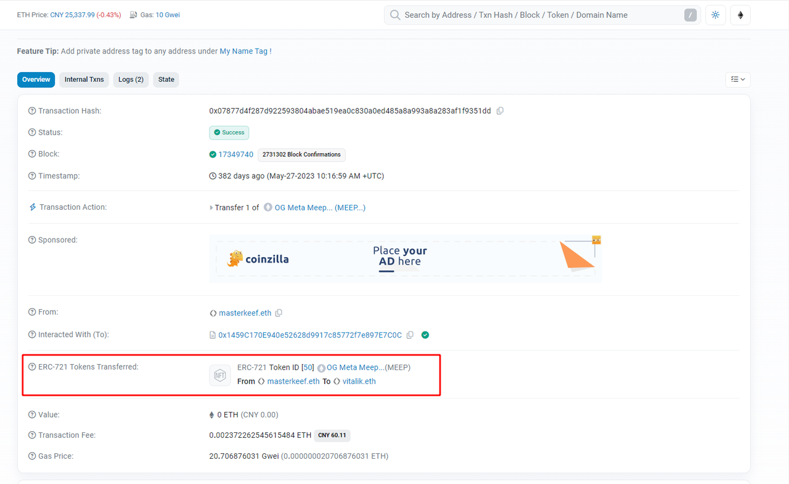
    >
    > 举例：Remitano 2 与 USDT 智能合约交互，将 550.4 USDT 转入钱包地址 0xc4d。
    >
    > 【PS：Interacted with (to) 这意味着该交易与智能合约进行了交互】
    >
    > 
  - 在交易所 A 币换 B 币
    > 举例：用户 0x4891a03281f3642E0445e2674340C34b80961d7C，在 uniswap V2 上，用 0.368 ETH 换了 0.368 WETH，又换成 663,458.502152036 AIR 币。路径： `用户` → `Uniswap V2: Router 2` → `Uniswap V2: AIR 41` → `用户`。
    >
    > 补充知识：
    >
    > WETH 是一种符合 ERC-20 标准以太坊代币，与以太坊网络的原生代币以太币（ETH）可以进行 `1:1` 互换。ETH 是以太坊网络的原生代币。它是在 ERC-20 代币标准化之前创建的。ETH 与 ERC-20 标准和使用它的代币不兼容。所以，我们在挂单买卖 nft 的时候，只能用 weth。
    >
    > 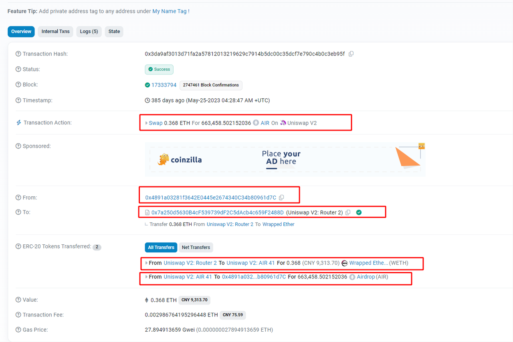
    >
    > 举例：用户 0xC688f622d061b39AD62181cCE49E45ca99998bdF，用 1.5689 ETH 换了 1.5689 WETH，又换成了 22,060,760,461,219.416771739582056405 vitalik.eth 币，给了另一个用户 0xd8dA6BF26964aF9D7eEd9e03E53415D37aA96045
    >
    > 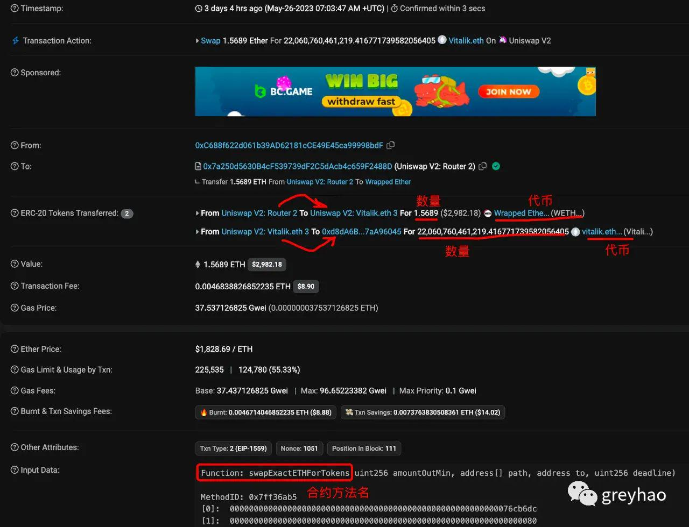
  - 留言功能
    
  - 转账给自己
    
  - 交易失败情况
    - Out of gas（Gas 不足）：转账时设置的 Gas 不足，使用高级模式设置合理的 Gas 重新发起转账即可。
      
    - Reverted：出现 Reverted 错误，属于合同执行过程中遇到错误。这笔交易虽然是失败的，（但是依然会被扣除矿工费，并且交易取消不会扣除代币。
      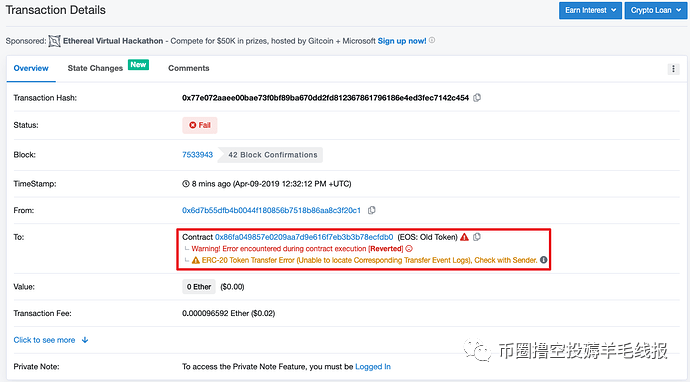
    - Bad instruction（错误指令） ：这种问题属于一般错误类型。这笔交易虽然是失败的，但是依然会被扣除矿工费，并且交易取消不会扣除代币。
      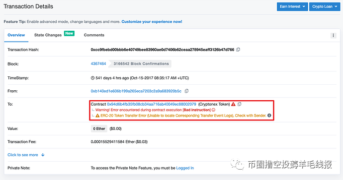

### 9、币

### 10、其他概念

#### 1）DID

即分布式数字身份。相对于传统的基于 PKI（Public Key Infrastructure, 公钥基础设施）的⾝份体系，基于区块链建⽴的 DID 数字⾝份系统具有保证数据真实可信、保护⽤户隐私安全、可移植性强等特点

- 真正把个人的隐私权、数据权交还给每一个人自由掌控：就像我们把身份证、护照、户口本这些纸质文件放在自己家里小心保存，只有在需要的时候再拿出来一样，不再有任何中间人完全拥有用户的身份和数据，可以较好避免上面的困境

#### 2）SBT

Soulbound 代币 (SBT) 是使用区块链技术代表个人身份的不可转让代币。这可能包括医疗记录、工作经历以及构成个人或实体的任何类型的信息。持有或发行这些记录的钱包被称为“灵魂”。

- SBT 不可转让和交易，个人钱包获得 SBT 之后，就相当于获得个人标签，这个标签是个人特定行为的认证。比如 V 神在 2022 年就获得的多个 POAP 的认证 NFT，也是代表他的这些活动行为。

#### 3）POAP

POAP 是 ProofofAttendanceProtocol 的缩写，中文是出勤证明协议，是指透过区块链技术创造数字徽章或是数字收藏品的协议，但 POAP 这个词也代表数字徽章本身

- 作用：用于证明你有参加某项活动，用户可以藉由收藏 POAP 来记录他在区块链上的活动纪录
- 总结：POAP 是一种参与证明，只要参加活动，用户就会获得一个 POAP 徽章做为参加的证明，这个徽章 是 NFT
- POAP 官网：https://poap.xyz/

#### 4）OAT

OAT 是 On-chainAchievementToken 的缩写，跟 POAP 很像，是一种可以代表出席证明或是成就证明的 NFT，当你完成项目给出的任务或是符合条件，就可以获得 OAT 徽章

- 目前发放 OAT 徽章最大的平台是 Project Galaxy（用户通过完成任务获得 OAT 或 NFT）
- 这些任务可能是参加项目方 AMA、追踪项目推特、完成表单、加入官方 Discord / Telegram 等等…

#### 5）LP

- 流动性：是指在不引起价格发生重大变化的情况下，轻松交易资产的能力。
  【流动性高】：比特币 BTC 这样的加密货币就属于流动性很高的资产，任意数量的比特币可在数千个交易平台轻松交易，且价格一般不会受到交易本身的影响
  > 【流动性低】：去中心化金融(DeFi)和较小项目的流动性就很低，某种代币只在单一平台上线交易，或者很难找到与订单匹配的买家和卖家。
- 解决【流动性低】的项目方法：流动性资金池模式（或称为“流动性挖矿”）
- 流动性资金池：包含两种用户可相互交换的资产，无需做市商、吃单方和订单簿，无需依赖他人匹配订单。价格完全由池中的资产比率决定。
  - 流动性供应商（Liquidity Provider）：将代币对存入池中促成交易的用户。流动性供应商会向借用他们代币完成交换的用户收取少量费用。
  - 流动性质押池 POOL
  - 流动性资金池代币（LP 代币）：或称为“流动性供应商代币”。是支付给为流动性资金池提供流动性的用户的一种代币。这些代币作为收据凭证，用于连本带利赎回质押。LP 代币可用于在流动性挖矿中赚取复利、取得加密货币贷款或转让质押流动性的所有权。只有放弃对所持 LP 代币的托管，才能真正获得相应的流动性。
- 流动性资金池代币（LP 代币）如何运作：
  - （1）采用自动化做市商(AMM)模式，流动性供应商存入智能合约的一批资金（流动性质押池 POOL），建立起流动性资金池，资金池中定好 2 种数字货币的交易价格，将两种不同的数字货币按照一定的比例组合在一起，届时只要保证池中流动性充足，所有人都可以对资金池进行方便快速的交易，用户通过智能合约与流动性资金池进行交易。
  - （2）用户将代币对存入流动性资金池后，会收到 LP 代币作为“收据”。LP 代币代表了用户投入池中的份额，也作为赎回存入代币和收取获利的凭证。
    > 举个例子，假设现在 Token A 和 Token B 的价格分别是 1 美元和 10 美元，那么要组成流动池，需要以 10 个 Token A 和一个 Token B 这样的比例进行组合。在这种情况下，只要池子中的 Token A 和 Token B 足够多，就能满足任何人来进行 1 比 10 的兑换需求。但某一段时间，大家都想要 Token A，出现了大量拿 Token B 换 Token A 的现象，导致池子中的 Token A 减少，Token B 相对较多，池子中的 Token A 和 Token B 达不到 10 比 1，这个时候就需要流动性供应商提供币 A 到池子里，使得池子中两者比例达到最初的平衡，保证其他人来兑换时能顺利进行。
  - 网络上任何人都能成为流动性供应商 LP，但是必须按照按照当前池子中两种币的比例质押两种币。如 LP 代币丢失，则投入的份额将全部损失。
  - 提供流动性时，LP 代币存储于用户使用的钱包中。如果要查看个人加密货币钱包中的 LP 代币，则需添加对应 LP 代币的智能合约。
  - 大多数 LP 代币均可在钱包之间互相转移，进而转让所有权。但有时也存在特例，比如在某些情况下转移代币会导致永久丧失提供的流动性，因此需要提前了解清楚对应流动性资金池的相关规则。、
- 在哪里可以获得流动性资金池代币（LP 代币）：
  - DeFi Dapp（PancakeSwap、Uniswap）、自动化做市商（AMM）、DEX（去中心化交易所）、
  - LP 代币通常以提供流动性的两种代币命名。【pancakeSwap 流动性资金池：有两种币 CAKE 和 BNB，所以用户获得的 BEP-20 代币称为“CAKE-BNB LP”代币】、【以太坊中的 LP 代币则称“ERC-20 代币”。】
- 为什么要做 LP：
  - 获得奖励费（挖矿奖励）：因为所有在去中心化交易平台中发生的交易都会收取一定的手续费，届时会用手续费中的一部分分给 LP 作为奖励。奖励以 LP 代币的形式出现，并与进行的交易量成比例增长
    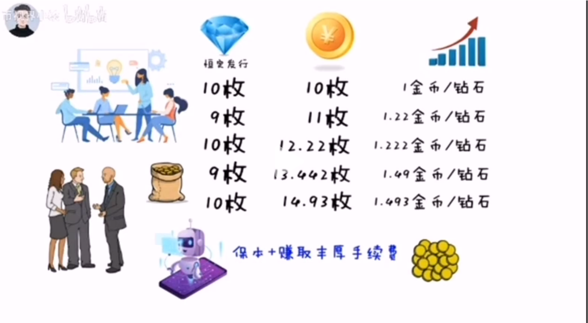
- 如何计算 LP 资金池变化：

## 二、问题 List

### 1、NFT 的价值在哪？为什么一个 NFT 价格可以被炒到那么高？

**总结：主要是因为市场上对其“项目”的认可度很高，而且 NFT 本身带有稀缺性、独特性的特质而造就的。当然，也有可能存在猎奇和炒作的因素，但这并不否定 NFT 作为一种创新和潜力巨大的数字资产形式。**
NFT 的特点：

- 稀缺性：这世上很多东西的价值或溢价，往往并非来自它本身，而是源于它的稀缺性。比如限量发售的球鞋、游戏王的青眼白龙卡、盲盒的隐藏款等等。那么，如果一张数字图片是独一无二的，它的价值是不是也会飞升呢？这就是 NFT 的基础概念。
- 独特性：因为 NFT 的智能合约中都嵌入一种可进行身份识别信息，也就是说每个 NFT 都拥有独一无二的“编号”。也因此，NFT 成为纪录和存储包括艺术品、游戏和收藏品等数字产品所有权的理想选择。它可以让一张数字图片变得独一无二，所有人共同见证它是在何时何地被何人创作，又被何人买下。
- 不可篡改且可溯源：Web3 或者说区块链，可以让数据无法篡改且可溯源，确保每一件收藏品的真伪，而不是像现在很多球鞋交易平台那样，分不清到底是不是莆田高仿。这对知识产权保护至关重要，也让更多艺术家愿意去创作数字形式的艺术品。
  NFT 项目重要指标：
- 社区活跃度：社群人数、点赞、评论
- 平均持有率：items（发行数）÷ owers（持有人数）
- 创始团队质量：是否有明星、大 V（天然自带流量）
- 是否值得投资：road map，有长期可靠的发展规划
  **投资建议：NFT 的初衷或许是保护知识产权，但在现实中，已经被很多人当做了投机炒作的工具。例如股票投资市场，投资需谨慎。**

## 三、参考资料（推荐资料）

1. Web3：
   1. [Web3 入门科普：概念，应用与挑战](https://baijiahao.baidu.com/s?id=1735511151347249387&wfr=spider&for=pc)：比较全面和通俗的解释 Web3 到区块链、NFT 的知识
   2. [一文看懂 Web3 是什么](https://mp.weixin.qq.com/s?__biz=MzI3MDUwNDU0Ng==&mid=2247564593&idx=2&sn=ec3f4c075ffb8ce318d88001d03a19ac&chksm=ead3ba3cdda4332a57ec94dd953c4c8436310829cbcc4a187f45f9448dba4f8eb5fc3c1ada7a&scene=27)：从技术架构的视角解释 Web3
   3. [Web 3.0 通识课](https://j08v3n7cqq.feishu.cn/docs/doccnu8PLq5zJcaZJUzTaLyEOPc#ZBldk5)
   4. https://alexdphan.com/research/library-of-web3
2. 区块链相关：
   1. 我的的一个 NFT 项目：比较全面和通俗的区块链学习网站，只需 1 小时即可入门
   2. 区块链详解：涉及区块链、以太坊、智能合约、NFT、百度超级链等知识点
      https://www.yuque.com/books/share/3e4d4f19-4223-4191-8809-19c036a65101?# 密码：cg1a
3. DeFi
   1. [知乎回答 1](https://www.zhihu.com/question/324838085/answer/1526607416)
   2. [知乎回答 2](https://www.zhihu.com/question/324838085/answer/1656275835)
   3. [区块链学堂——预言机、预言机网络、预测市场](https://www.jianshu.com/p/4ce703c29db3)：预言机、预言机网络概念讲解
   4. [WBTC](https://baijiahao.baidu.com/s?id=1750616741586287960&wfr=spider&for=pc)：WBTC 概念讲解
   5. [什么是 ERC-20、ERC-777、ERC-721 和 ERC-1155？它们有何不同？](https://www.panewslab.com/zh/articledetails/4p0e0nspprdd.html)
4. 元宇宙
   1. [【游戏之外】超硬核！深度拆解元宇宙！我们能否迎来全新的时代与机遇？\_哔哩哔哩\_bilibili](https://www.bilibili.com/video/BV1RP4y157PC/?spm_id_from=888.80997.embed_other.whitelist)
5. 钱包
   1. [Cryptocurrency Wallets: A Beginner's Guide](https://www.investinblockchain.com/cryptocurrency-wallets-for-beginners/)
   2. [链视界-什么是 DID?怎么与区块链结合?](http://www.biwanshequ.com/article-4123-1.html)
   3. [区块链黑暗森林自救手册](https://mp.weixin.qq.com/s/A2XQEWlH25o8YsWjwCz2HQ)
